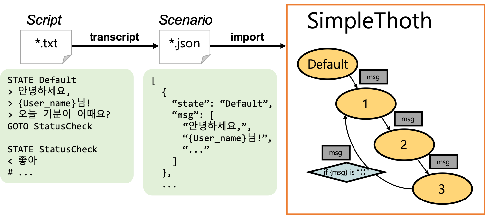

# StoryForestScripts

이야기치료 기반 심리 치유 챗봇 '이야기의 숲'의 대화 스크립트를 다루는 저장소입니다.



대화 모델은 [SimpleThoth](https://github.com/GBS-Skile/SimpleThoth) 인스턴스에서
구현됩니다. 한 인스턴스 내 대화의 흐름은 **시나리오(Scenario)** 라고 불리는
JSON 파일 하나에 의해서 모두 결정됩니다. 시나리오는 State Diagram 형태로 구성됩니다.
JSON 파일 특성상 시나리오를 사람이 직접 작성하기에는 번거롭기 때문에,
SimpleThoth 전용 문법으로 **스크립트(Script)** 를 작성하고
이를 시나리오 형태로 **전사(Transcribe)** 하는 방법을 사용합니다.

## 배포하기

즉, 본 저장소에서 작성한 스크립트를 배포하기 위해서는 크게 다음의 과정을 거쳐야 합니다.

1. 스크립트 파일을 시나리오로 전사하기
2. 변환한 시나리오 파일로 SimpleThoth 도커 컨테이너 만들기

### 스크립트 파일을 시나리오로 전사

배포 과정은 배포할 서버(아마도 Venus)의 `deployed` 브랜치에서 진행해주세요.
서버에는 Docker와 [docker-compose](https://docs.docker.com/compose/install/)가 설치되어 있어야 합니다.

```
$ git checkout deployed
$ git pull origin master
$ docker-compose -f ts_all.yml up
```

`scripts/` 디렉토리에 있던 모든 스크립트가
`scenarios/` 디렉토리에 전사된 내용을 확인할 수 있습니다.
변경 사항을 원격 저장소에도 공지합니다.

```
$ git add scenarios/*
$ git commit -m "Transcribe scripts"
$ git push origin deployed
```

### SimpleThoth 도커 컨테이너 만들기

```
$ docker-compose restart
```

2019년 11월 16일 기준
[SimpleThoth의 최신 버전은 0.1.5입니다.](https://pypi.org/project/simplethoth/#history)
만약 다른 버전의 SimpleThoth로 스크립트를 편집하고 싶거나
포트 및 컨테이너 목록의 변동이 필요한 경우
`docker-compose.yml`를 검토해 주세요.
